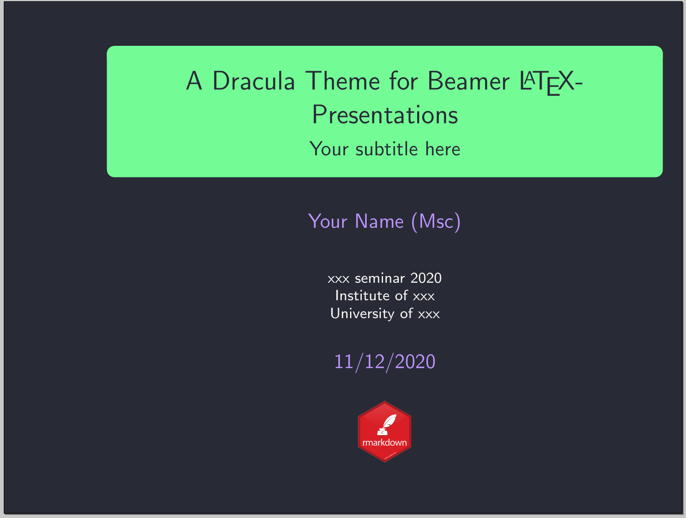
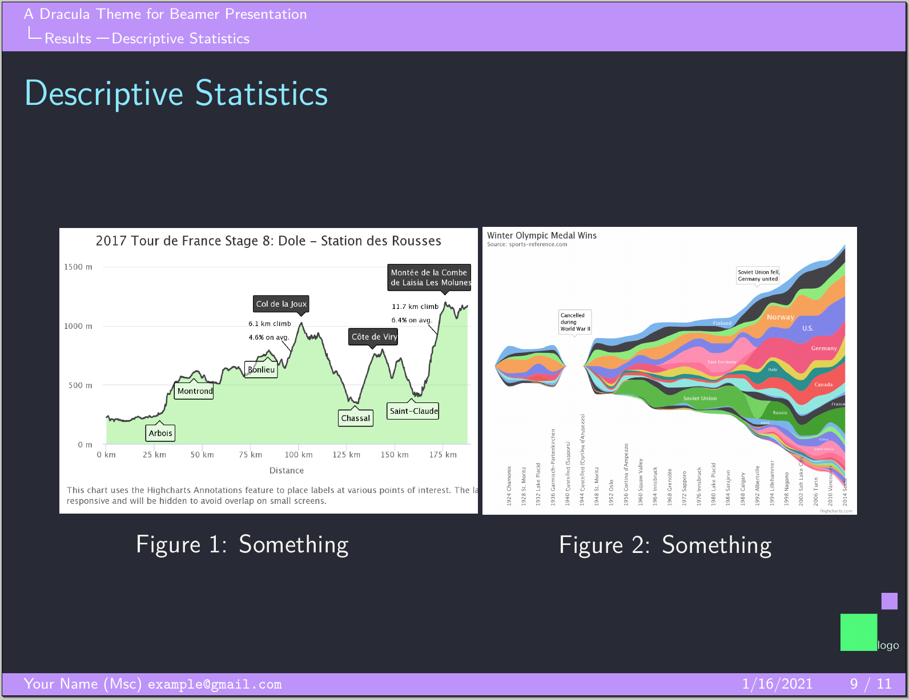
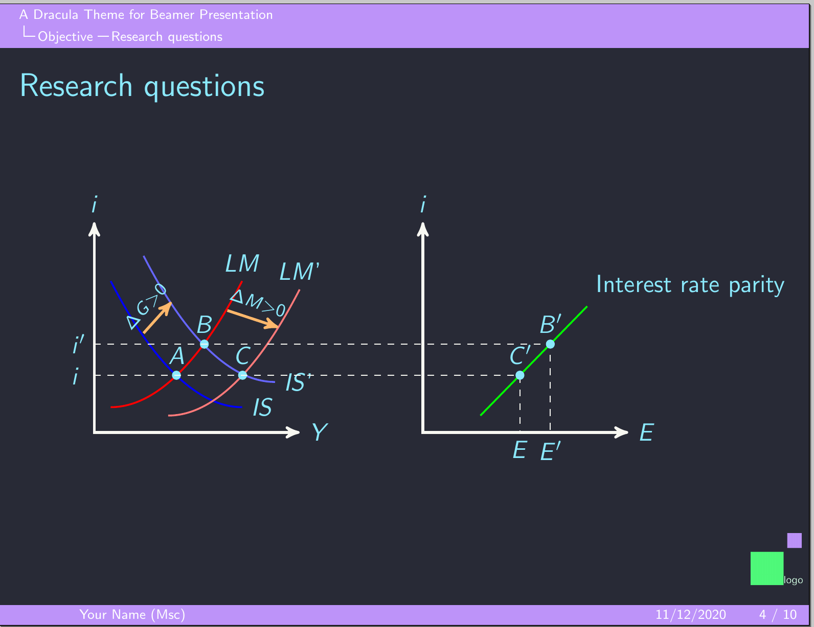
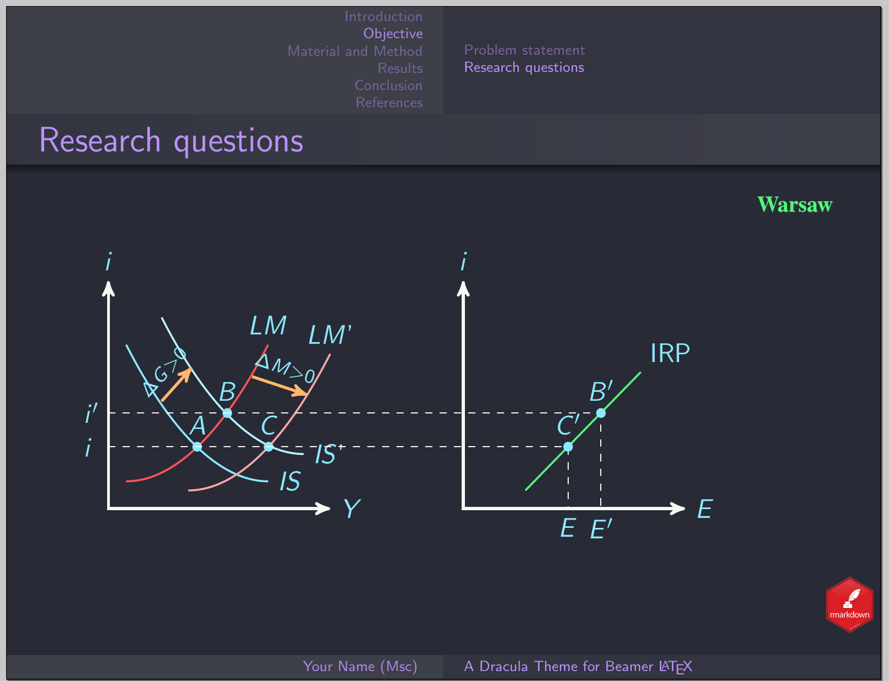

# Dracula for [Beamer](https://ctan.org/pkg/beamer?lang=en)

> A dark theme for [Beamer](https://ctan.org/pkg/beamer?lang=en).

|Antibes   | PaloAlto   |
|-----------------|-----------------|
|  CambridgeUS |  Ilmenau |
|  Warsaw |

## Install

- All instructions can be found at [draculatheme.com/Beamer](https://draculatheme.com/Beamer).
- If you are using beamer with [R Markdown](https://rmarkdown.rstudio.com/), check this [repository](https://gitlab.com/bsrthyle/dracula-dark-theme-for-r-markdown-beamer)

## Team

This theme is maintained by the following person

 |
--- |
[Bisrat Haile](https://github.com/bsrthyle) |

## License

[MIT License](./LICENSE)