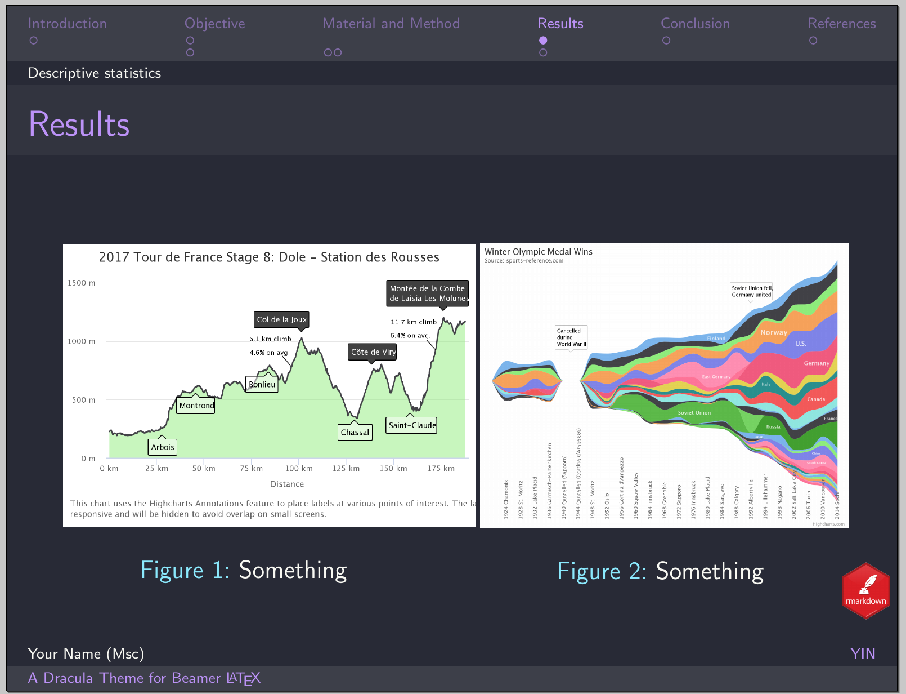

# Dracula for [Beamer](https://ctan.org/pkg/beamer?lang=en)

> A dark theme for [Beamer](https://ctan.org/pkg/beamer?lang=en).

|Default   | PaloAlto   |
|-----------------|-----------------|
|CambridgeUS   |Ilmenau   |
|Warsaw   |Antibes  

## Install

All instructions can be found at [draculatheme.com/beamer](https://draculatheme.com/beamer).

## Team

This theme is maintained by the following person.

 |
--- |
[Bisrat Haile](https://github.com/bsrthyle) |

## License

[MIT License](./LICENSE)