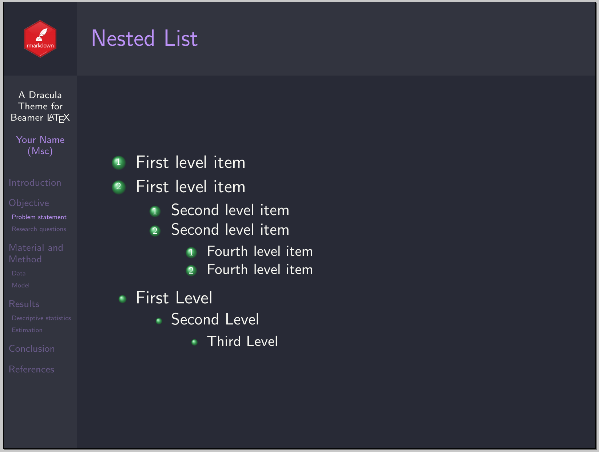

# Dracula for [Beamer](https://ctan.org/pkg/beamer?lang=en)

> A dark theme for [Beamer](https://ctan.org/pkg/beamer?lang=en).

| Default        | PaloAlto  |
| --------------------------------- | ------------------------------ |
| CambridgeUS  | Ilmenau   |
| Warsaw       | Antibes   |

## Install

All instructions can be found at [draculatheme.com/beamer](https://draculatheme.com/beamer).

## Team

This theme is maintained by the following person.

|  |
| ---------------------------------------------------------------------------------------- |
| [Bisrat Haile](https://github.com/bsrthyle)                                              |

## Community

- [Twitter](https://twitter.com/draculatheme) - Best for getting updates about themes and new stuff.
- [GitHub](https://github.com/dracula/dracula-theme/discussions) - Best for asking questions and discussing issues.
- [Discord](https://draculatheme.com/discord-invite) - Best for hanging out with the community.

## License

[MIT License](./LICENSE)
